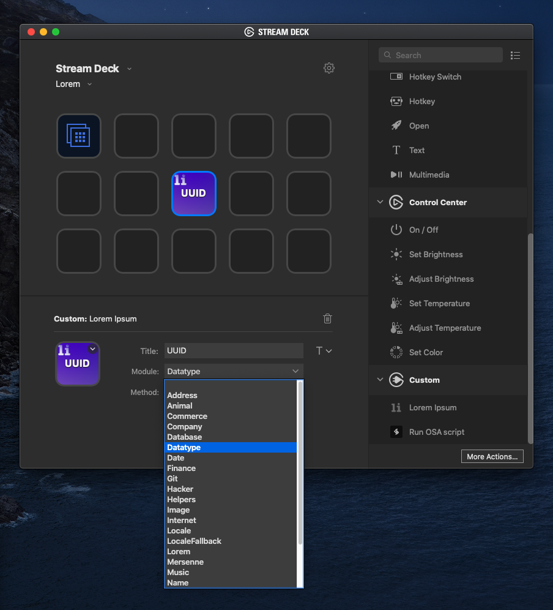

# streamdeck-loremipsum

## Description

`Lorem Ipsum` is a plugin that uses the [Faker](https://github.com/marak/Faker.js/) library to generate randomized data.

## Features

- code written in Javascript
- cross-platform (macOS, Windows)
- Property Inspector with multiple UI elements
- localized

## Installation

In the Release folder, you can find the file `com.michaelminter.loremipsum.streamDeckPlugin`. If you double-click this file on your machine, Stream Deck will install the plugin.

## Source code

The Sources folder contains the source code of the plugin.
